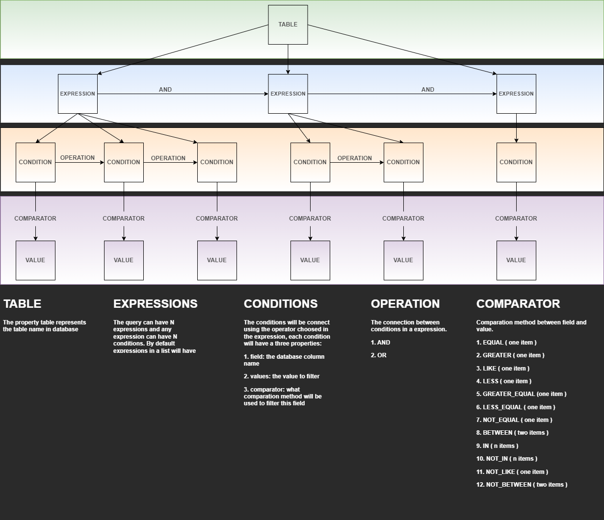

# spring-jpa-zuin-filter-library
In this repository you will find the source code responsible for all the logic of the zuin filter spring jpa.

The easiest way to create filters using spring, works to all your tables, all your columns, and only one dto request model.


## Endpoint 💻


- [x] Filter example.
- Searching in table "HOSPITAL" with conditions.  
 ```json
 {
	   "table":"HOSPITAIS",
	   "expressions":[
		  {
			 "conditions":[
				{
				   "field":"ID",
				   "values":[
					  "1"
				   ],
				   "comparator":"EQUAL"
				},
				{
				   "field":"NOME_HOSPITAL",
				   "values":[
					  "UNIDADE SANTO AMARO"
				   ],
				   "comparator":"EQUAL"
				}
			 ],
			 "operation":"AND"
		  }
	   ]
}
 ```

## Configure
- [x] pom.xml dependency.
 ```xml
<dependency>
	<groupId>com.github.enayzuin.spring.jpa.filter</groupId>
	<artifactId>zuin-spring-jpa-filter</artifactId>
	<version>1.0.0</version>
</dependency>
 ```
- [x] See more how to use in
[ /spring-jpa-zuin-filter-library-example](https://github.com/enayzuin/zuin-spring-jpa-filter-usage-example)]
---

### Author

---
ENAY ZUIN
---
